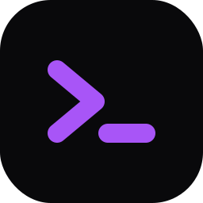

<div align="center">
  <br />
  
  <h1>firstKodes</h1>
  <p><strong>Plataforma gamificada de ensino de programação para quem está começando.</strong></p>

  <p>
    
    
    
    
    
    
    
  </p>
</div>

---

## Sobre

**firstKodes** é uma aplicação web interativa que ensina lógica de programação com Python de forma divertida e progressiva. Através de fases temáticas, desafios "chefão" e um sistema de progresso gamificado (vidas, streaks, desbloqueio de módulos), o iniciante é guiado por conceitos fundamentais da programação.

### Módulos

| | Módulo | Conteúdo |
|---|--------|----------|
| 🔤 | **Fundamentos** | Variáveis, tipos de dados, `print` e operadores básicos |
| 🔀 | **Decisões** | Estruturas condicionais (`if`/`elif`/`else`) |
| 🔁 | **Repetições** | Laços (`while`, `for`, `break`) |
| 📦 | **Funções e Listas** | Definição de funções (`def`/`return`), listas e índices |

---

## Funcionalidades

- 🎮 **Fases Interativas** — Complete códigos selecionando palavras-chave
- ❤️ **Sistema de Vidas** — 3 vidas por módulo; erre e aprenda com o feedback
- 💾 **Progresso Persistente** — Salvo no `localStorage` com streaks e desbloqueio progressivo
- 🤖 **Modo Prática** — Gera 5 questões personalizadas por módulo via IA
- 👑 **Desafio Chefão** — Fase final com editor de código livre e tutoria do Clippy
- 🦎 **Tutor IA (Clippy)** — Feedback contextual que se adapta ao número de vidas restantes
- 🎠 **Carrossel de Módulos** — Navegação intuitiva com animações suaves
- 🔥 **Celebração de Streak** — Comemoração ao completar o primeiro módulo do dia

---

## Stack

| | Tecnologia | Versão | Finalidade |
|---|------------|--------|------------|
| ⚡ | [Next.js](https://nextjs.org/) | 14.2 | Framework React com App Router |
| ⚛️ | [React](https://react.dev/) | 18.3 | Biblioteca de UI |
| 🛡️ | [TypeScript](https://www.typescriptlang.org/) | 5.7 | Tipagem estática |
| 🎨 | [Tailwind CSS](https://tailwindcss.com/) | 3.4 | Estilização utilitária |
| 🌀 | [Framer Motion](https://www.framer.com/motion/) | 11.15 | Animações e transições |
| 🎯 | [Lucide React](https://lucide.dev/) | 0.468 | Ícones |
| 🧠 | [OpenRouter API](https://openrouter.ai/) | — | Integração com modelos de IA |
| 📐 | [ESLint](https://eslint.org/) | 8.57 | Linting |
| 🎨 | [PostCSS](https://postcss.org/) / [Autoprefixer](https://github.com/postcss/autoprefixer) | — | Processamento CSS |

---

## Começando

### Pré-requisitos

- Node.js 18+ 
- npm, yarn ou pnpm

### Instalação

```bash
# Clone o repositório
git clone https://github.com/igordiaazz/firstkodes.git
cd firstkodes

# Instale as dependências
npm install

# Configure a chave da API OpenRouter
cp .env.local.example .env.local
# Edite .env.local com sua chave:
# OPENROUTER_API_KEY=sk-or-v1-xxxxxxxxxxxx
# OPENROUTER_MODEL=google/gemini-2.5-flash (opcional)
```

### Desenvolvimento

```bash
npm run dev
```

Acesse [http://localhost:3000](http://localhost:3000).

### Produção

```bash
npm run build
npm start
```

---

## Estrutura do Projeto

```
src/
├── app/
│   ├── api/
│   │   ├── check-code/route.ts     # API de tutoria IA
│   │   └── generate-practice/route.ts  # Geração de exercícios IA
│   ├── globals.css                 # Estilos globais + Tailwind
│   ├── layout.tsx                  # Layout raiz (fonte Inter)
│   ├── page.tsx                    # Página principal
│   └── icon.svg                    # Favicon / logo
├── components/
│   ├── BossPhase.tsx               # Fase chefão (editor livre)
│   ├── Carousel.tsx                # Carrossel de módulos
│   ├── Footer.tsx                  # Rodapé
│   ├── GameLevel.tsx               # Fase principal (seleção de palavras)
│   └── StreakCelebration.tsx       # Modal de streak
├── data/
│   ├── moduleOneLevels.ts          # Fases do módulo 1 (Fundamentos)
│   └── modulesConfig.ts            # Fases dos módulos 2, 3 e 4
├── hooks/
│   └── useProgress.ts              # Hook de progresso (localStorage)
└── types/
    └── css.d.ts                    # Declaração de tipos CSS
```

---

## API

### `POST /api/check-code`

🧑‍🏫 Envia o código do usuário para o tutor IA e retorna feedback.

```json
{
  "challenge": "string",
  "code": "string",
  "lives": 3
}
```

### `POST /api/generate-practice`

📝 Gera 5 questões de múltipla escolha para um módulo.

```json
{
  "moduleName": "Fundamentos"
}
```

---

## Licença

📄 Este projeto é privado.

---

<div align="center">
  <sub>Feito com amor por <a href="https://github.com/igordiaazz">Igor Dias</a></sub>
</div>
